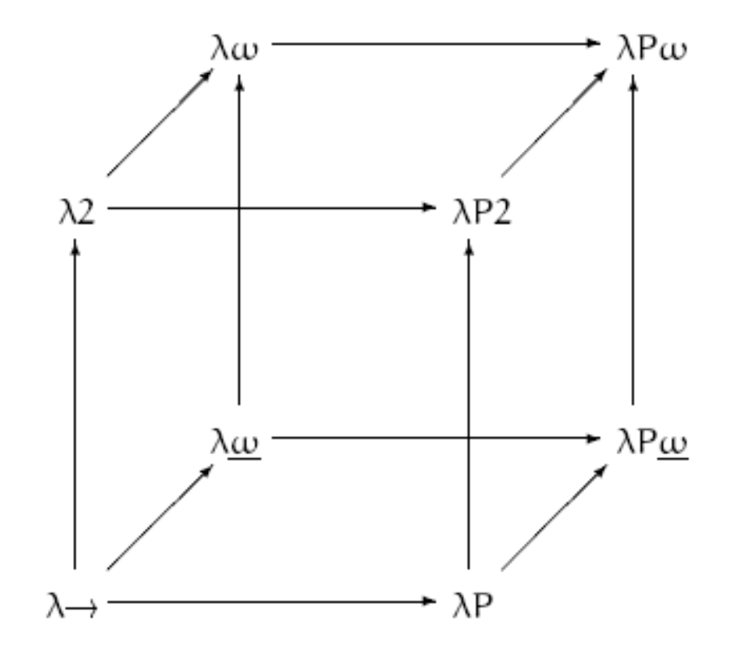
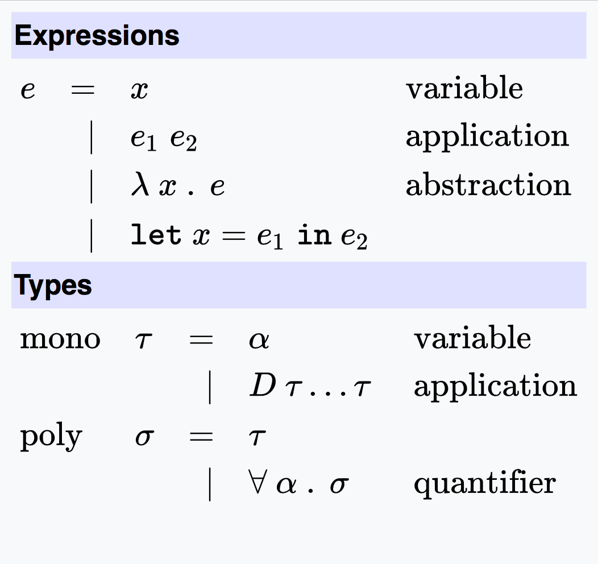

# Programación Declarativa

Este repositorio esta creado para dar ejemplos de que es la programación declarativa con programas en Haskell.

## ¿Qué es la programación Declarativa?

La programación declarativa es un paradigma de programación de programación, que da la descripción de un problema en lugar de proveer una solucion para dicho problema, dejando la interpretación de los pasos específicos para llegar a dicha solución a un interprete o compilador.
 

### Calculo Lambda
 El cálculo lambda fue desarrollado por Alonso Church en la década del 30 con el objeto de dar una teoría general de las funciones.

El cálculo lambda es un equivalente a las máquinas Turing ya que es capaz de evaluar y expresar cualquier función computable. El cálculo lambda se dio para darle fundamento de lenguajes de programación.



Haskell es un lenguaje de programación que se encuentra dentro de lambda 2, y Hindley–Milner type system y tiene la siguiente sintaxis. 




## Usando Haskell
 
Haskell es un lenguaje de programación puramente funcional, con toda la base de calculo lambda actuado por detrás, haciendo que Haskell sea elegante y consiso.

Es también de evalución perezosa. Eso significa que, a menos que se especifique lo contrario, Haskell no ejecutará funciones y calculará las cosas hasta que esté realmente obligado a mostrarle un resultado y está tipado estáticamente. Cuando compila su programa, el compilador sabe qué parte del código es un número, que es una cadena, etc. Eso significa que muchos errores posibles se detectan en tiempo de compilación, todo gracias el HM system y el calculo lambda. Haskell posee el uso de Mónadas que facilitan la vida del programador, y son herramientas muy potentes, demostrables que se basan el teoría de Categorias.

### Descargando Haskell

Puedes descargarlo directamente desde su página oficial de manera gratuita [Download Haskell](https://www.haskell.org/platform/) y aprenderlo con ayuda del libro [Aprende Haskell](http://learnyouahaskell.com/introduction#about-this-tutorial).

Una ves descargado puedes acceder al modo interactivo usando:

```
➜ ~ ghci
GHCi, version 8.0.2: http://www.haskell.org/ghc/  :? for help
Prelude>  :l program.hs

```
Con Prelude puedes compilar tus programas :l program.hs, si editaste algo basta con :r para refrescar.

Les recomiendo tomar un curso de Programación Declarativa, ya que Haskell provee demasiado, y es demasiado poderoso y es una herramienta que ningún programador se arrepentira de aprender.
 

## Authors

* **Ximena Lezama** - [LezamaXi](https://github.com/LezamaXi)
